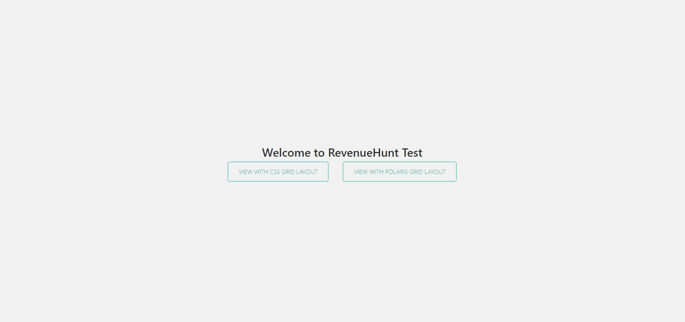
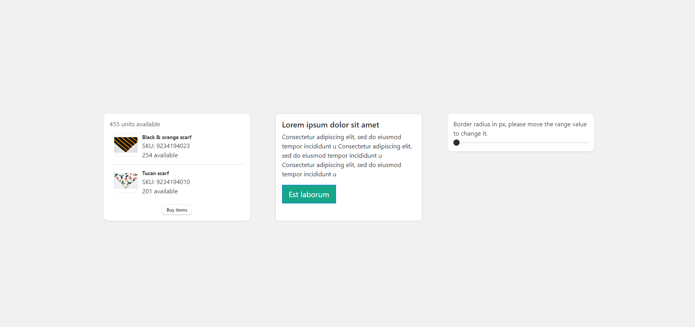

# RevenueHunt-Test

He creado 3 columnas responsive con css y con el layout de shopify polaris. Utilicé Vite + React, implementación de shopify polaris, bootstrap y css puro. Para la lógica he utilizado context para el cambio de color del botón y su border-radius.

Pasos para la instalación:
- Descargar repositorio.
- Una vez abierto en tu terminal de tu editor de código favorito realizar un npm install.
- El proyecto se levanta con npm run dev o realizar un npm run build y luego un npm run preview para ver un prev de la producción.

Imagen 1:

Imagen 2:

